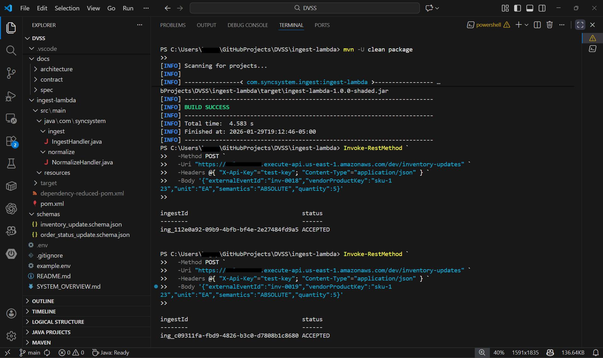
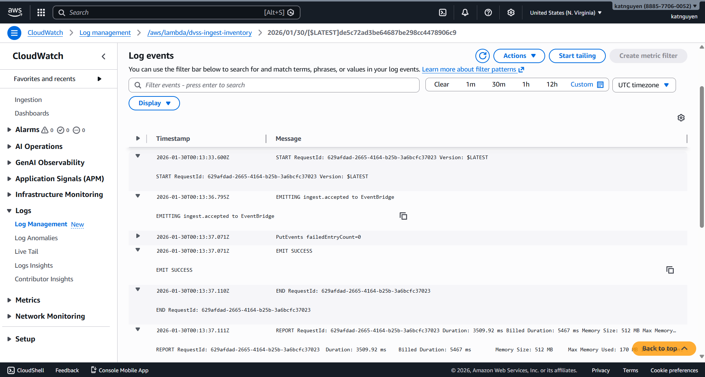

# Distributed Vendor Synchronization System

This repository is an event-driven ingestion + normalization pipeline for vendor order/inventory updates. It prioritizes **durability, idempotency, and traceability** so unreliable vendor payloads can be safely accepted, validated, normalized, and replayed.

## End-to-End Ingestion and Normalization Flow (Sequence Diagram)


## Repository Navigation

```
.
├── ingest/                 # Ingest Lambda source
├── normalize/              # Normalize Lambda source
├── schemas/                # Standardized schema definitions (JSON Schema)
├── docs/
│   ├── architecture/       # System and flow diagrams (including DDB/S3 layouts)
│   ├── contract/           # Event formats + examples
│   └── spec/               # Design notes and decisions
├── infra/                  # Infrastructure definitions (AWS)
└── README.md
```

For diagrams and detailed contracts, see:

* `docs/architecture/`
* `docs/contract/`

---

## Deployed System Overview (Live Environment)

### 1. API Invocation (Vendor → Ingest API)



A vendor submits an inventory update via the HTTP ingest endpoint.  
Each request returns a generated `ingestId`, which is used to correlate the event across
storage, logs, and downstream processing. Repeated submissions with the same
`externalEventId` are safely handled via idempotency.

---

### 2. Ingest Index (DynamoDB – `IngestRecords`)


The `IngestRecords` table tracks logical events keyed by `(vendorId, externalEventId)`.  
This table enforces **at-most-once acceptance** using conditional writes and records the
canonical `ingestId`, ingestion timestamp, raw payload location, and current status.

---

### 3. System Tables Overview (DynamoDB)


This app separates concerns across multiple DynamoDB tables, including ingest indexing,
canonical state, vendor mappings, divergence tracking, quarantine, and outbox emission.
This layout reflects the system’s stage-isolated, failure-tolerant design.

---

### 4. Ingest Execution and Event Emission (CloudWatch Logs)



Structured logs from the ingest Lambda show request lifecycle events and the successful
emission of an `ingest.accepted` event to EventBridge. These logs provide traceability
across asynchronous stages without coupling ingest availability to downstream processing.

---

### 5. Raw Payload Storage (S3 – Write-Once Object)


Each accepted event is written **once** to immutable S3 storage under a deterministic,
time-partitioned key that includes the `ingestId`. Raw payloads are never modified or
overwritten, enabling safe replay, auditing, and downstream reprocessing.

--- 

## End-to-End Flow

1. **Vendor → Ingest API**: vendor submits an event with `vendorId` + `externalEventId`.
2. **Ingest Lambda**:

   * validates envelope
   * enforces idempotency
   * writes raw payload to S3 (write-once)
   * emits an EventBridge event referencing the raw object
3. **Normalize Lambda**:

   * loads raw payload
   * validates vendor payload (schema/version aware)
   * maps to a standardized event format
   * writes normalized output to S3 (and/or downstream sink)

All stages correlate via a shared `ingestId`.

---

## Data Contracts

This section defines the external and internal event formats used by the app.  
These examples are representative; additional versions and vendor-specific variants live in `docs/contract/`.

### Ingest Request (Vendor → DVSS)

Vendors submit events to the ingest endpoint using a stable envelope that supports
idempotency, traceability, and schema evolution.

```json
{
  "vendorId": "vendorA",
  "externalEventId": "inv-12345",
  "eventType": "inventory_update",
  "occurredAt": "2026-01-30T20:15:12Z",
  "payload": {
    "sku": "ABC-001",
    "qty": 12,
    "warehouse": "ROA"
  }
}
```

### Normalized Output (DVSS → Standard Schema)

After validation and mapping, vendor payloads are emitted in a standardized,
versioned format suitable for downstream consumers.

```json
{
  "ingestId": "01HZX...K3",
  "vendorId": "vendorA",
  "externalEventId": "inv-12345",
  "eventType": "InventoryUpdated",
  "schemaVersion": "1.0",
  "occurredAt": "2026-01-30T20:15:12Z",
  "data": {
    "warehouseId": "ROA",
    "sku": "ABC-001",
    "quantityOnHand": 12
  },
  "rawRef": {
    "bucket": "dvss-raw-prod",
    "key": "raw/vendorA/2026/01/30/01HZX...K3.json"
  }
}
```

Additional event contracts, schema versions, and example payloads are documented in `docs/contract/`.

---

## Storage Layout (DynamoDB + S3)

### DynamoDB (Idempotency / Event Index)

**Table:** `dvss_ingest_index`

Primary key (recommended):

* **PK:** `vendorId`
* **SK:** `externalEventId`

Common attributes:

* `ingestId` (ULID/UUID)
* `receivedAt` (ISO timestamp)
* `rawS3Key`
* `status` (RECEIVED | NORMALIZED | FAILED_NORMALIZE)
* `schemaVersion` (optional)
* `ttl`

**Idempotency enforcement:** `PutItem` with a **conditional write** (only succeed if `(vendorId, externalEventId)` does not already exist).

### S3 (Write-once Raw + Derived Normalized)

Raw payloads (immutable):

```
s3://<raw-bucket>/raw/<vendorId>/YYYY/MM/DD/<ingestId>.json
```

Normalized outputs:

```
s3://<normalized-bucket>/normalized/<eventType>/YYYY/MM/DD/<ingestId>.json
```

Diagram references (including bucket policies and object lifecycle) are in `docs/architecture/`.

---


## Operational Guarantees (Implementation Overview)

* **Accepted at most once per logical event**

  * Enforced by **DynamoDB conditional writes** on `(vendorId, externalEventId)`.

* **Raw payloads are never lost or mutated**

  * Raw is written **once** to S3 under an immutable key (`ingestId`) and never overwritten. (Optional hardening: checksum stored in DynamoDB + object lock/versioning).

* **Processing can be safely retried or replayed**

  * Replay works by re-enqueuing normalization from stored raw objects; **idempotency** prevents duplicated logical events from producing duplicate downstream state.

* **Failures in downstream stages do not block ingestion**

  * Ingest is decoupled from normalize via **EventBridge**. Normalize failures route to **DLQ** / failure stream without impacting ingest availability.

---

## Performance Targets and Limits (Metrics that matter)

These are the **tested operating ranges**:

* **Max payload size:** e.g., 256 KB (API Gateway limit dependent; enforced by request validation)
* **Throughput target:** e.g., 50–200 events/sec sustained (scales via Lambda concurrency + DynamoDB partitioning)
* **P50 ingest latency:** e.g., < 200ms to accept + persist raw (excluding vendor network)
* **P95 ingest latency:** e.g., < 800ms under moderate load
* **Normalize latency:** dependent on mapping/validation; measured separately
* **Primary cost drivers:** S3 PUTs, Lambda invocations/duration, DynamoDB WCUs (conditional writes), EventBridge events

---

## Testing and Validation

This app correctness depends on validating idempotency, schema handling, and retries.

The system is validated across multiple test layers:

* **Unit tests**

  * idempotency decision logic (duplicate vs first-seen)
  * envelope validation and error mapping
  * normalization mapping functions

* **Contract tests**

  * `schemas/` JSON Schema validation for both ingest envelope and normalized events
  * golden-file tests: input payload → expected normalized output

* **Integration tests**

  * LocalStack (or AWS sandbox) exercising: API → ingest → S3 write → EventBridge → normalize → normalized write

* **Replay tests**

  * reprocessing a known raw object produces the same normalized result and does not double-count logical events

---

## Observability and Traceability

### Correlation

* Every stage logs `ingestId`, `vendorId`, and `externalEventId`.

### Example structured log (Ingest)

```json
{
  "level": "INFO",
  "msg": "Ingest accepted",
  "ingestId": "01HZX...K3",
  "vendorId": "vendorA",
  "externalEventId": "inv-12345",
  "rawS3Key": "raw/vendorA/2026/01/30/01HZX...K3.json",
  "status": "RECEIVED",
  "latencyMs": 143
}
```

### Core metrics (examples)

* `dvss.ingest.accepted` (count) — dims: `vendorId`
* `dvss.ingest.duplicate` (count) — dims: `vendorId`
* `dvss.ingest.failed_validation` (count) — dims: `vendorId`, `reason`
* `dvss.normalize.success` (count) — dims: `vendorId`, `eventType`
* `dvss.normalize.failed` (count) — dims: `vendorId`, `eventType`, `reason`
* `dvss.pipeline.latency_ms` (histogram) — dims: `stage`

### Failure handling

* Normalize failures route to a DLQ / failure event stream for investigation and replay.
* Alarms should be attached to DLQ depth and sustained normalize failures.

---

## Security Considerations

* Least-privilege IAM roles per component
* Encrypted storage at rest and in transit
* No secrets committed to source control
* Public access blocked on all storage resources

---

## Running / Deploying

This app is deployed as a set of AWS-managed resources defined in the `infra/` directory.  
The system is designed to run fully serverless and does not require long-running services.

### Prerequisites
- AWS account with permissions to deploy Lambda, API Gateway, DynamoDB, S3, and EventBridge
- AWS CLI configured locally
- Node.js / Python runtimes matching the Lambda implementations
- (Optional) LocalStack for local integration testing

### Deployment Overview
1. Deploy infrastructure resources from `infra/`  
   (API Gateway, Lambdas, DynamoDB tables, S3 buckets, EventBridge rules)

2. Configure environment variables and IAM roles required by:
   - Ingest Lambda
   - Normalize Lambda

3. Expose the ingest endpoint to vendors via API Gateway.

4. Apply rate limits and authentication controls at the API layer.

### Submitting Events
Vendors submit events to the ingest endpoint containing:
- `vendorId`
- `externalEventId`
- event payload matching the expected contract

Example requests and payload formats are documented in `docs/contract/`.

### Verifying Operation
After deployment, verify the system by:
- Submitting a test event to the ingest endpoint
- Confirming raw payload persistence in S3
- Observing ingest and normalize logs in CloudWatch
- Verifying normalized output artifacts or downstream emissions

### Local / Sandbox Testing
For development and validation, app components can be exercised using:
- LocalStack or an isolated AWS sandbox account
- Integration tests that simulate end-to-end ingestion and normalization flows

Detailed environment-specific setup and scripts are documented in the `/docs` directory.

---

## Future Enhancements (AI Integration)

The next phase of the app focuses on **reducing operational cost and manual integration effort** while preserving the system’s existing guarantees around durability, scalability, and fault tolerance. These enhancements are designed as **incremental extensions** to the current architecture.

### 1. AI-Assisted Schema Mapping and Normalization (First Priority)

Introduce an AI-assisted normalization layer to automatically infer mappings between vendor-specific schemas and standardized event formats.

Potential capabilities:

* Automatic field matching across vendors with differing naming conventions
* Detection of structurally equivalent fields despite schema drift
* Reduction of manual schema onboarding and maintenance effort
* Faster integration of new vendors with minimal human intervention

This would significantly reduce engineering time and ongoing maintenance cost associated with supporting heterogeneous vendor payloads.

---

### 2. Intelligent Schema Drift Detection and Alerting

Extend normalization to proactively detect and classify schema changes using heuristic and ML-based techniques.

Enhancements include:

* Automated detection of new, removed, or renamed fields
* Confidence-based classification of breaking vs non-breaking changes
* Early warning signals before downstream processing is affected

This enables faster response to vendor changes while minimizing ingestion failures and operational overhead.

---

### 3. Cost-Aware Processing and Adaptive Routing

Leverage historical ingest and processing metrics to dynamically optimize system behavior.

Examples:

* Adaptive batching or throttling for high-volume vendors
* Intelligent routing of low-risk payloads through lightweight validation paths
* Prioritization of critical updates during peak load

These optimizations improve cost efficiency by aligning compute usage with payload complexity and business importance.

---

### 4. Automated Replay, Backfill, and Recovery Workflows

Enhance replay capabilities with automated tooling and orchestration.

Potential improvements:

* Time-window-based reprocessing from raw payload storage
* Targeted replays for specific vendors or schema versions
* Automated recovery workflows following downstream failures

This further reduces operational cost by minimizing manual intervention during incident response or data correction.

---

### 5. AI-Driven Data Quality Scoring

Introduce scoring mechanisms to assess payload quality and reliability over time.

Capabilities:

* Assign confidence scores to vendor updates based on historical behavior
* Identify vendors with frequent schema or data quality issues
* Inform downstream systems of data reliability levels

This supports smarter downstream processing and more efficient resource allocation.
